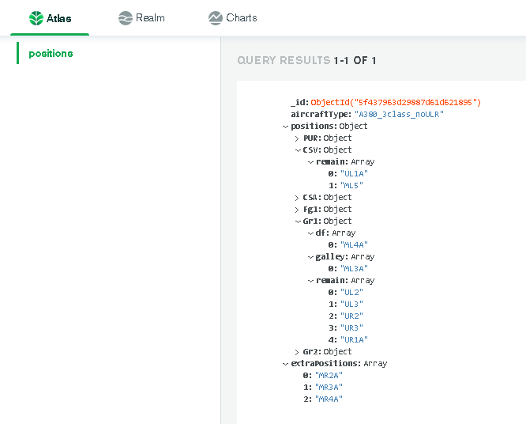
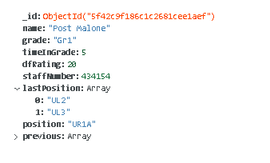

# Automatic allocation of crew positions

Requires [MongoDB driver](https://mongodb.github.io/node-mongodb-native/ "MongoDB") to run.

Algorithm pulls data from 2 collections (positions and crew) in database (crew).
Positions represented in multidimentional object to track position types and grades.
    

Algorithm runs through each position and filter crew suitable for thsi position according to criteria:
- previous position
- time in grade
- rating duty free
- grade
- has no allocated position
If multiple crew suits filter criteria, than crew selected randomly.
   
After this selected positions pushed back to crew collection in database.    

    
Thank you.